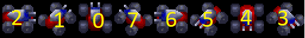

# Angles in D2TM. How to calculate & draw
This document describes a bit how the angles work in D2TM, especially
when comparing two things and how an entity (ie a unit) should face another
entity.

In summary d2tm angles are clock-wise, starting from the top. You calculate
the degrees using `fDegrees`, and with that you can calculate a `facing angle`.
From the `facing angle` you can calculate a `drawing index` to be used for a bitmap.

# Degrees between two points
D2TM considers 2 'points', a 'from' (the center of an imaginary cirlce) and
a 'to' which is at the edge of the circle.

Given these two points you get a `degrees`. You get this by calling `fDegrees`.

It takes `x1,y1` and `x2,y2`. Where `x1,y1` is always considered to be the 'from', ie
center of the 'circle'.


https://user-images.githubusercontent.com/1332066/154132193-3d7eeb5b-79bb-4221-967f-4c14f3981059.mp4


# Determining 'facing angle'
Once we have this degrees value you can convert this to "angles", which
are basicallys segments within that circle to determine what the 'facing angle'
would be for a unit or projectile. Use `faceAngle` for this.

This function takes the amoutn of `degrees` we had from `fDegrees` and
the amount of `angles` (segments) you have in the circle. Assuming 0 degrees is `up`.

```
float degrees = fDegrees(fromX, fromY, toX, toY);
int facingAngle = faceAngle(degrees);
```

When no `angles` are given, `faceAngle` assumes `8`.

# Determining drawing index
Consider this QUAD image:



The numbers (in yellow) are the D2TM face angles. Notice that the third picture of the Quad, facing up, has `facing angle` of `0`. The third picture of the Quad is called a `drawing index`. These go from left to right from `0` and upwards. The first `drawing index` (`0`) is the Quad facing to the right. 

## Rotation
As we move from left to right on the bitmap, the Quad's facing angle is going into a counter-clockwise direction. All D2TM bitmaps of units have this. However, rockets have a clockwise rotation (and 16 angles, instead of 8).

## Converting `face angle` to `drawing index`
There are 2 things required to determine the `drawing index` on the Quad picture, to make it correspond with the `facing angle` we described above. Facing angle `0` means `up`, meaning it should correspond with `drawing index` nr `2`. Then as we go to the right on the Quad's bitmap, our facing angle is going backwards.

In code, in order to convert between a `faceAngle` to a `drawIndex` on the bitmap you use `convertAngleToDrawIndex`

```
float degrees = fDegrees(fromX, fromY, toX, toY);
int facingAngle = faceAngle(degrees);
int drawIndex = convertAngleToDrawIndex(facingAngle);
```

Without any extra parameters `convertAngleToDrawIndex` assumes that the bitmap is using pictures going into a counter-clockwise direction (like the QUAD above).

When the drawing index goes to the left it will correspond with the facing angle.

Putting it all together, this is the result:

| Facing angle | QUAD draw index |
|--------------|-----------------|
| 0            | 2               |
| 1            | 1               |
| 2            | 0               |
| 3            | 7               |
| 4            | 6               |
| 5            | 5               |
| 6            | 4               |
| 7            | 3               |

As you can see, the left column, the d2tm facing angle goes from 0 to 7.
The QUAD index goes down (from 7 to 0), but it *also* has a different starting point. The 2nd picture has a QUAD facing upwards. This is called an offset.

By default `convertAngleToDrawIndex` assumes an offset of `2`, and that the bitmap uses counter-clockwise rotation. You can overrule that if you want.

Projectiles (rockets) have a starting point of `0` and a clock-wise rotation.
